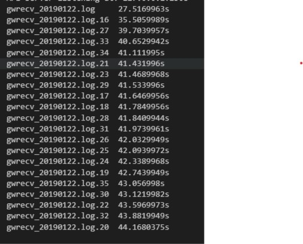

# parsing_logdir
- parsing files from directory
- 디렉토리의 모든 파일을 파싱하고 새로운 파일로 저장합니다.

## Precondition
- line start: "["
- line end: "]"
- sperator: "]["
- log path: D:/Desktop/gwrecv_20190122/*
- output file: source filename + ".txt"
- number of CPU to use: 8

## processing
- 21개 파일 2.04G 처리 1분 미만
  - 